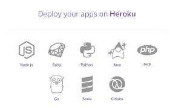

# what is Heroku

It’s a service for developers eager to get their applications online without having to worry about infrastructure details.

## What is Heroku and why are its application deployments so simple

Heroku…

* Runs your application across a preset number of virtual servers.
* Manages releases by rolling out your application to different environments.
* Ensures your application automatically recovers from server failures.
* Handles load balancing across many application instances, allowing you to instantly scale your application to support millions of users.
* Allows you to quickly add and remove infrastructure blocks like caching servers and database servers.

 Heroku supports the Ruby, Node.js, Python, Java, Go, PHP, and Scala programming languages. This provides easy deployment of existing technologies on Heroku with minimum modifications needed.

 ## How Heroku Pricing Works

One of the benefits of using a cloud provider like Heroku in the first place is that you pay only for what you use. In the case of Heroku, since they bill in increments of seconds, that’s pretty much exactly what you use.