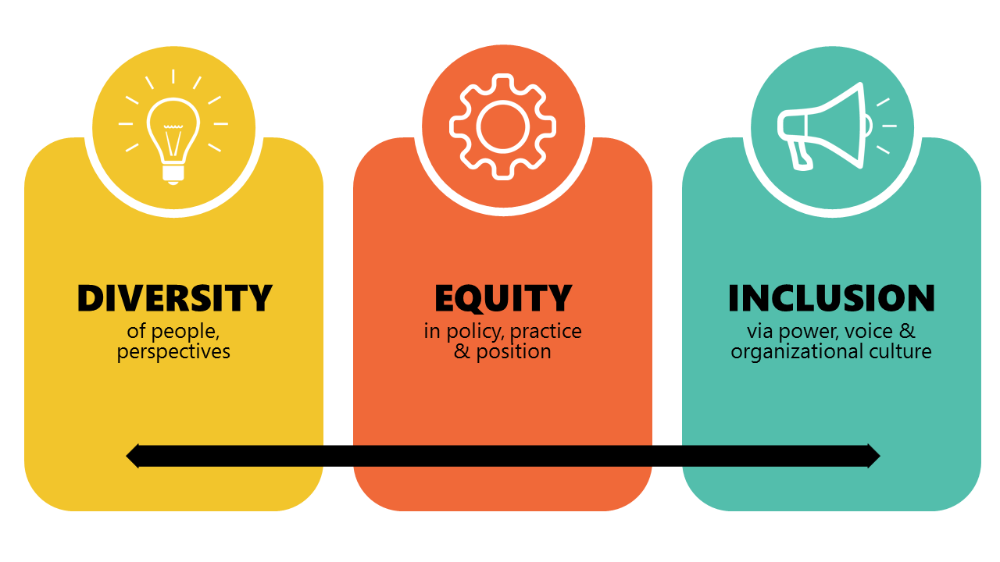

 

## Silicon Valleys gender gap is the result of computer-game marketing 20 years ago

Its no secret that there is a pronounced gender gap in technology fields. In 2014, 70% of the employees at the top tech companies in Silicon Valley, such as Google, Facebook, and Twitter, were male. In technical roles, this phenomenon is even more pronounced; for example, only 10% of the technical workforce at Twitter is female.

But things haven always been this way. The numbers of enrollments among men and women in computer science were on their way toward parity in the 1970s and early 1980s. In 1984, 37% of computer science graduates were women, but those numbers began to drop dramatically in the middle of the decade. By 2016, that number had been whittled down to 18%. This dip in the 1980s has created a chasm that the past 30 years hasn’t been able to overcome—and the dude-centric computer marketing campaigns of that time may be to blame.

-  Programming is fast becoming the most lucrative skill you can have in the modern world
-  Women will not have the same access to the opportunities presented by this industry.
-  Data Analysis 2016: Latest Figures
-  In the last 12 months, Facebook, Apple, eBay and Microsoft hired 1% more women. LinkedIn increased their female staff by 3%. Googles gender ratio stayed the same.
-  Microsoft gained 3% non-white employees, Facebook 2%; while Google, Apple and eBay increased their non-white staff by 1%. LinkedIn lost 3% of its non-white employees.

> Diverse companies can better serve a diverse user base
When the employees of an organization better represent their users and desired users, they will build more effectively for those groups. When YouTube’s almost entirely right-handed developer team built the iOS app without considering how left-handed people would use it, for example, 5% to 10% of videos were uploaded upside down as a result. This factor may be especially relevant for leaders of consumer tech companies.

> the right thing to do
While diversity and inclusion efforts are most often driven by business rationales, spoken with a few CEOs who are motivated primarily by a belief that cultivating an inclusive tech community is simply the right thing to do.
Some of these leaders have noted that the tech industry is creating vast opportunity and that by excluding certain groups from that opportunity the industry is perpetuating and exacerbating existing social inequality. Others have emphasized a concern that by failing to involve particular communities in the process of creating of new technology, we as a society lose out on the benefits of those community members ideas.

For company leaders beginning to consider diversity and inclusion, understanding these rationales and identifying one that resonates for you and your organization can be a helpful first step.
But only a first step. After deciding that diversity matters and articulating its importance, leaders must create a strategy for building a more diverse, inclusive company and an accountability plan to ensure that strategy is effective.